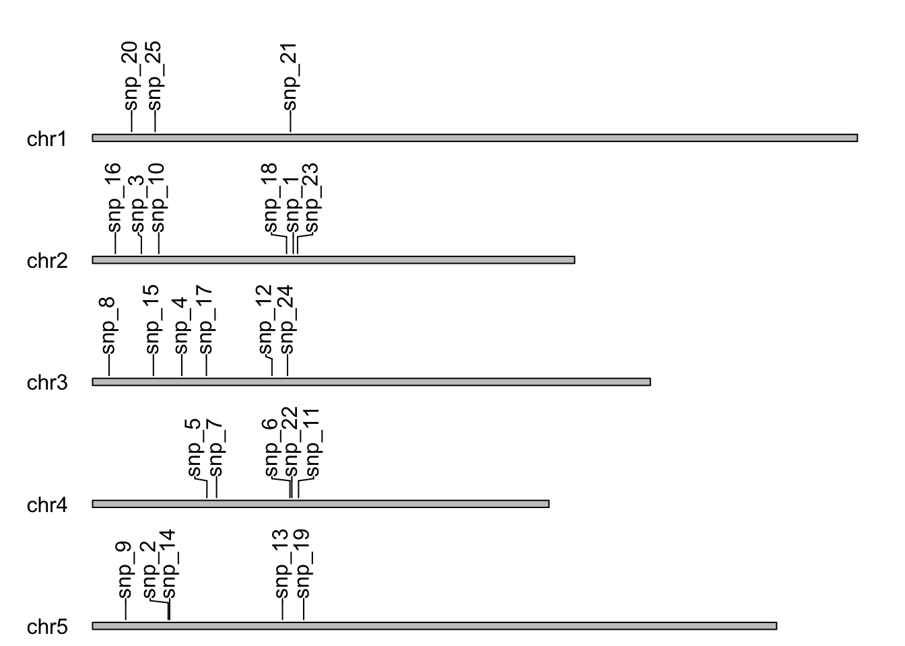
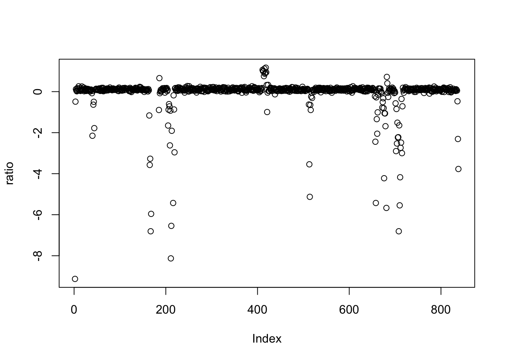

# Finding Genetic Variants with High-throughput Sequencing Data

To be able to answer where the genetic variants on genome, or how many there are and whether one could classify them, I cover the following techniques:

- To find SNPs and indels in sequencing data using _VariantTools_

- To predict ORF in long reference sequences

- To plot features on genetic maps with _karyoploteR_

- To find alternative transcript isoforms

- To select and classify variants using _VariantAnnotation_

- To extract information in genomic regions of interest

- To find phenotype and genotype associations with GWAS

- To estimate the copy number at a locus of interest

For these, I will need the following packages:

- _Biostrings, GenomicRanges, gmapR, karyoploteR, rtracklayer, systemPipeR, SummarizedExperiment, VariantAnnotation, VariantTools_ from _Bioconductor_

- _rrBLUP_

# Finding SNPs and Indels from Sequence Data using _VariantTools_

Here, I will create a pipeline from reads to lists of genes with variants.

```{r message=FALSE, warning=FALSE}
# load packages
library(GenomicRanges)
library(gmapR)
library(rtracklayer)
library(VariantAnnotation)
library(VariantTools)
```

```{r message=FALSE, warning=FALSE}
# load the datasets
bam_folder <- file.path(getwd())
bam_folder_contents <- list.files(file.path(getwd()))
bam <- file.path(bam_folder, "hg17_snps.bam")
fasta_file <- file.path(bam_folder,"chr17.83k.fa")
```

```{r message=FALSE, warning=FALSE}
# set up the genome object
fa <- rtracklayer::FastaFile(fasta_file)
genome <- gmapR::GmapGenome(fa, create=TRUE)
```

```{r}
# set up the parameter objects
var_params <- VariantCallingFilters(read.count = 19,
                                    p.lower = 0.01)
qual_params <- TallyVariantsParam(genome = genome,
                                  minimum_mapq = 20)
```

```{r}
# call the variants
called_variants <- callVariants(bam, qual_params,
                                calling.filters = var_params)
head(called_variants)
```

```
## VRanges object with 6 ranges and 17 metadata columns:
##           seqnames    ranges strand         ref              alt     totalDepth
##              <Rle> <IRanges>  <Rle> <character> <characterOrRle> <integerOrRle>
##   [1] NC_000017.10        64      *           G                T            759
##   [2] NC_000017.10        69      *           G                T            812
##   [3] NC_000017.10        70      *           G                T            818
##   [4] NC_000017.10        73      *           T                A            814
##   [5] NC_000017.10        77      *           T                A            802
##   [6] NC_000017.10        78      *           G                T            798
##             refDepth       altDepth   sampleNames softFilterMatrix | n.read.pos
##       <integerOrRle> <integerOrRle> <factorOrRle>         <matrix> |  <integer>
##   [1]            739             20          <NA>                  |         17
##   [2]            790             22          <NA>                  |         19
##   [3]            796             22          <NA>                  |         20
##   [4]            795             19          <NA>                  |         13
##   [5]            780             22          <NA>                  |         19
##   [6]            777             21          <NA>                  |         17
##       n.read.pos.ref raw.count.total count.plus count.plus.ref count.minus
##            <integer>       <integer>  <integer>      <integer>   <integer>
##   [1]             64             759         20            739           0
##   [2]             69             812         22            790           0
##   [3]             70             818         22            796           0
##   [4]             70             814         19            795           0
##   [5]             70             802         22            780           0
##   [6]             70             798         21            777           0
##       count.minus.ref count.del.plus count.del.minus read.pos.mean
##             <integer>      <integer>       <integer>     <numeric>
##   [1]               0              0               0       30.9000
##   [2]               0              0               0       40.7273
##   [3]               0              0               0       34.7727
##   [4]               0              0               0       36.1579
##   [5]               0              0               0       38.3636
##   [6]               0              0               0       39.7143
##       read.pos.mean.ref read.pos.var read.pos.var.ref     mdfne mdfne.ref
##               <numeric>    <numeric>        <numeric> <numeric> <numeric>
##   [1]           32.8755      318.558          347.804        NA        NA
##   [2]           35.4190      377.004          398.876        NA        NA
##   [3]           36.3442      497.762          402.360        NA        NA
##   [4]           36.2176      519.551          402.843        NA        NA
##   [5]           36.0064      472.327          397.070        NA        NA
##   [6]           35.9241      609.076          390.463        NA        NA
##       count.high.nm count.high.nm.ref
##           <integer>         <integer>
##   [1]            20               738
##   [2]            22               789
##   [3]            22               796
##   [4]            19               769
##   [5]            22               780
##   [6]            21               777
##   -------
##   seqinfo: 1 sequence from chr17.83k genome
##   hardFilters(4): nonRef nonNRef readCount likelihoodRatio
```

```{r}
# functions to read annotation from files
get_annotated_regions <- function(file_name){
  gff <- import.gff(file_name)
  as(gff, "GRanges")
}

get_annotated_regions2 <- function(file_name){
  bed <- import.bed(file_name)
  as(bed, "GRanges")
}
```

```{r}
# get annotations
genes <- get_annotated_regions("chr17.83k.gff3")
```

```{r}
# calculate overlapping variants
overlaps <- findOverlaps(called_variants, genes)
overlaps
```

```
## Hits object with 12684 hits and 0 metadata columns:
##           queryHits subjectHits
##           <integer>   <integer>
##       [1]     35176           1
##       [2]     35176           2
##       [3]     35176           3
##       [4]     35177           1
##       [5]     35177           2
##       ...       ...         ...
##   [12680]     40944           2
##   [12681]     40944           7
##   [12682]     40945           1
##   [12683]     40945           2
##   [12684]     40945           7
##   -------
##   queryLength: 44949 / subjectLength: 8
```

```{r}
# as a list
genes[subjectHits(overlaps)]
```

```
## GRanges object with 12684 ranges and 20 metadata columns:
##               seqnames      ranges strand |   source       type     score
##                  <Rle>   <IRanges>  <Rle> | <factor>   <factor> <numeric>
##       [1] NC_000017.10 64099-76866      - |   havana ncRNA_gene        NA
##       [2] NC_000017.10 64099-76866      - |   havana lnc_RNA           NA
##       [3] NC_000017.10 64099-65736      - |   havana exon              NA
##       [4] NC_000017.10 64099-76866      - |   havana ncRNA_gene        NA
##       [5] NC_000017.10 64099-76866      - |   havana lnc_RNA           NA
##       ...          ...         ...    ... .      ...        ...       ...
##   [12680] NC_000017.10 64099-76866      - |   havana lnc_RNA           NA
##   [12681] NC_000017.10 76723-76866      - |   havana exon              NA
##   [12682] NC_000017.10 64099-76866      - |   havana ncRNA_gene        NA
##   [12683] NC_000017.10 64099-76866      - |   havana lnc_RNA           NA
##   [12684] NC_000017.10 76723-76866      - |   havana exon              NA
##               phase                         ID            Name     biotype
##           <integer>                <character>     <character> <character>
##       [1]      <NA>       gene:ENSG00000280279      AC240565.2     lincRNA
##       [2]      <NA> transcript:ENST00000623180  AC240565.2-201     lincRNA
##       [3]      <NA>                       <NA> ENSE00003759547        <NA>
##       [4]      <NA>       gene:ENSG00000280279      AC240565.2     lincRNA
##       [5]      <NA> transcript:ENST00000623180  AC240565.2-201     lincRNA
##       ...       ...                        ...             ...         ...
##   [12680]      <NA> transcript:ENST00000623180  AC240565.2-201     lincRNA
##   [12681]      <NA>                       <NA> ENSE00003756684        <NA>
##   [12682]      <NA>       gene:ENSG00000280279      AC240565.2     lincRNA
##   [12683]      <NA> transcript:ENST00000623180  AC240565.2-201     lincRNA
##   [12684]      <NA>                       <NA> ENSE00003756684        <NA>
##                description         gene_id  logic_name     version
##                <character>     <character> <character> <character>
##       [1] novel transcript ENSG00000280279      havana           1
##       [2]             <NA>            <NA>        <NA>           1
##       [3]             <NA>            <NA>        <NA>           1
##       [4] novel transcript ENSG00000280279      havana           1
##       [5]             <NA>            <NA>        <NA>           1
##       ...              ...             ...         ...         ...
##   [12680]             <NA>            <NA>        <NA>           1
##   [12681]             <NA>            <NA>        <NA>           1
##   [12682] novel transcript ENSG00000280279      havana           1
##   [12683]             <NA>            <NA>        <NA>           1
##   [12684]             <NA>            <NA>        <NA>           1
##                               Parent         tag   transcript_id
##                      <CharacterList> <character>     <character>
##       [1]                                   <NA>            <NA>
##       [2]       gene:ENSG00000280279       basic ENST00000623180
##       [3] transcript:ENST00000623180        <NA>            <NA>
##       [4]                                   <NA>            <NA>
##       [5]       gene:ENSG00000280279       basic ENST00000623180
##       ...                        ...         ...             ...
##   [12680]       gene:ENSG00000280279       basic ENST00000623180
##   [12681] transcript:ENST00000623180        <NA>            <NA>
##   [12682]                                   <NA>            <NA>
##   [12683]       gene:ENSG00000280279       basic ENST00000623180
##   [12684] transcript:ENST00000623180        <NA>            <NA>
##           transcript_support_level constitutive ensembl_end_phase ensembl_phase
##                        <character>  <character>       <character>   <character>
##       [1]                     <NA>         <NA>              <NA>          <NA>
##       [2]                        5         <NA>              <NA>          <NA>
##       [3]                     <NA>            1                -1            -1
##       [4]                     <NA>         <NA>              <NA>          <NA>
##       [5]                        5         <NA>              <NA>          <NA>
##       ...                      ...          ...               ...           ...
##   [12680]                        5         <NA>              <NA>          <NA>
##   [12681]                     <NA>            1                -1            -1
##   [12682]                     <NA>         <NA>              <NA>          <NA>
##   [12683]                        5         <NA>              <NA>          <NA>
##   [12684]                     <NA>            1                -1            -1
##                   exon_id        rank
##               <character> <character>
##       [1]            <NA>        <NA>
##       [2]            <NA>        <NA>
##       [3] ENSE00003759547           5
##       [4]            <NA>        <NA>
##       [5]            <NA>        <NA>
##       ...             ...         ...
##   [12680]            <NA>        <NA>
##   [12681] ENSE00003756684           1
##   [12682]            <NA>        <NA>
##   [12683]            <NA>        <NA>
##   [12684] ENSE00003756684           1
##   -------
##   seqinfo: 1 sequence from an unspecified genome; no seqlengths
```

# Predicting ORF in Long Reference Sequences

Here, I will be predicting open reading frames using _systemPipeR_.

```{r}
# load the libraries
library(Biostrings)
library(systemPipeR)
```

```{r}
# input genome
dna_object <- readDNAStringSet("arabidopsis_chloroplast.fa")
```

```{r}
# predict Open Reading Frames (ORF)
predicted_orfs <- predORF(dna_object,
                          n = "all",
                          type = "gr",
                          mode = "ORF",
                          strand = "both",
                          longest_disjoint = TRUE)
predicted_orfs
```

```
## GRanges object with 2501 ranges and 2 metadata columns:
##           seqnames        ranges strand | subject_id inframe2end
##              <Rle>     <IRanges>  <Rle> |  <integer>   <numeric>
##      1 chloroplast   86762-93358      + |          1           2
##   1162 chloroplast     2056-2532      - |          1           3
##      2 chloroplast   72371-73897      + |          2           2
##   1163 chloroplast   77901-78362      - |          2           1
##      3 chloroplast   54937-56397      + |          3           3
##    ...         ...           ...    ... .        ...         ...
##   2497 chloroplast 129757-129762      - |       1336           3
##   2498 chloroplast 139258-139263      - |       1337           3
##   2499 chloroplast 140026-140031      - |       1338           3
##   2500 chloroplast 143947-143952      - |       1339           3
##   2501 chloroplast 153619-153624      - |       1340           3
##   -------
##   seqinfo: 1 sequence from an unspecified genome; no seqlengths
```

GRanges object returened 2501 ORFs, thus, next step is to filter out some ORFs that occured by chance from the sequence.

```{r}
# calculate the properties of the reference genome
bases <- c("A", "C", "G", "T")
raw_seq_string <- strsplit(as.character(dna_object), "")
seqlength <- width(dna_object[1])
counts <- lapply(bases, function(x){sum(grepl(x, raw_seq_string))})
probs <- unlist(lapply(counts, function(base_count){signif(base_count / seqlength, 2)}))
```

```{r}
# find the longest ORF in a simulated genome
get_longest_orf <- function(x,
                            length = 1000,
                            probs = c(0.25, 0.25, 0.25, 0.25),
                            bases = c("A", "C", "G", "T")) {
  random_genome <- paste0(sample(bases,
                                 size = length,
                                 replace = TRUE,
                                 prob = probs), collapse = "")
  random_dna_object <- DNAStringSet(random_genome)
  names(random_dna_object) <- c("random_dna_string")
  orfs <- predORF(random_dna_object,
                  n = 1,
                  type = "gr",
                  mode = "ORF",
                  strand = "both",
                  longest_disjoint = TRUE)
  return(max(width(orfs)))
                            }
```

```{r}
# run the function on 10 simulated genomes
random_lenghts <- unlist(lapply(1:10,
                                get_longest_orf,
                                length = seqlength,
                                probs = probs,
                                bases = bases))
```

```{r}
# find the longest random ORF
longest_random_orf <- max(random_lenghts)

# keep only predicted ORFs longer than the longest random ORF
keep <- width(predicted_orfs) > longest_random_orf
orfs_to_keep <- predicted_orfs[keep]
head(orfs_to_keep)
```
```
## GRanges object with 6 ranges and 2 metadata columns:
##        seqnames      ranges strand | subject_id inframe2end
##           <Rle>   <IRanges>  <Rle> |  <integer>   <numeric>
##   1 chloroplast 86762-93358      + |          1           2
##   2 chloroplast 72371-73897      + |          2           2
##   3 chloroplast 54937-56397      + |          3           3
##   4 chloroplast 57147-58541      + |          4           1
##   5 chloroplast 33918-35141      + |          5           1
##   6 chloroplast 32693-33772      + |          6           2
##   -------
##   seqinfo: 1 sequence from an unspecified genome; no seqlengths
```

```{r}
# save the ORFs
extracted_orfs <- getSeq(dna_object, orfs_to_keep)
names(extracted_orfs) <- paste0("orf_", 1:length(orfs_to_keep))
writeXStringSet(extracted_orfs, "saved_orfs.fa")
```

# Plotting Features on Genetic Maps with karyoploteR

Here, I will create some visualisations for chromosomes and ideograms using _karyoploteR_ package.

```{r message=FALSE, warning=FALSE}
# load packages
library(karyoploteR)
library(GenomicRanges)
```

```{r}
# set up the genome object
genome_df <- data.frame(
  chr = paste0("chr", 1:5),
  start = rep(1, 5),
  end = c(34964571, 22037565, 25499034, 20862711, 31270811)
)
genome_gr <- makeGRangesFromDataFrame(genome_df)
```

```{r}
# set up the SNP positions
snp_pos <- sample(1:1e7, 25)
snps <- data.frame(
  chr = paste0("chr", sample(1:5, 25, replace = TRUE)),
  start = snp_pos,
  end = snp_pos
)
snps_gr <- makeGRangesFromDataFrame(snps)
```

```{r}
# create labels
snp_labels <- paste0("snp_", 1:25)

# set the plot margins
plot.params <- getDefaultPlotParams(plot.type = 1)
plot.params$data1outmargin <- 600
```

```{r}
# create the base plot and add tracks
kp <- plotKaryotype(genome = genome_gr,
                    plot.type = 1,
                    plot.params = plot.params)
kpPlotMarkers(kp, snps_gr, labels = snp_labels)
```


# Selecting and Classifying Variants with _VariantAnnotation_

Using a VCF file, I will do subsequent analyses that need further filtering and classification based on features of the individual variants like the depth coverage in the alternative allele.

```{r message=FALSE, warning=FALSE}
# load packages
library(VariantAnnotation)
```

```{r}
# create a prefilter function
is_not_microsat <- function(x){
  !grepl("microsat", x, fixed = TRUE)
}
```

```{r}
# load up the prefilter function into a FilterRules object
prefilters <- FilterRules(list(microsat = is_not_microsat))
```

```{r}
# create a filter function to keep variants where the reference allele is in less than half the reads
major_alt <- function(x){
  af <- info(x)$AF
  result <- unlist(lapply(af, function(x){
    x[1] < 0.5
  }))
  return(result)
}
```

```{r}
# load the filter function into a FilterRules object
filters <- FilterRules(list(alt_is_major = major_alt))
```

```{r}
# load the input VCF file and apply filters
vcf_file <- "sample.vcf.gz"
filterVcf(vcf_file, 
          "hg17", 
          "filtered.vcf",
          prefilters = prefilters,
          filters = filters)
```

# Extracting Information in Genomic Regions of Interest

Here, I will look in more detail at data that falls in a particular genomic region of interest, whether that be the SNPs and variants in a gene or the genes in a particular locus.

```{r}
# load packages
library(GenomicRanges)
library(rtracklayer)
library(SummarizedExperiment)
library(readr)
```

```{r}
# define functions that read and create GRanges
# from .GFF
get_granges_gff <- function(file_name){
  gff <- import.gff(file_name)
  as(gff, "GRanges")
}

# from .BED
get_granges_bed <- function(file_name){
  bed <- import.bed(file_name)
  as(bed, "GRanges")
}

# from .TXT
get_granges_txt <- function(file_name){
  df <- read_tsv(file_name, col_names = TRUE)
  makeGRangesFromDataFrame(df, keep.extra.columns = TRUE)
}
```

```{r}
# create GRanges objects
gr_from_gff <- get_granges_gff("arabidopsis_chr4.gff")
gr_from_txt <- get_granges_txt("arabidopsis_chr4.txt")
```

```{r}
# extract a region by filtering on attributes
genes_on_chr4 <- gr_from_gff[gr_from_gff$type == "gene" & seqnames(gr_from_gff) %in% c("Chr4")]
```

```{r}
# manually create a region of interest
region_of_interest_gr <- GRanges(
  seqnames = c("Chr4"),
  IRanges(c(10000), width = c(1000))
)
```

```{r}
# Use the region of interest to subset the larger object
overlap_hits <- findOverlaps(region_of_interest_gr,
                             gr_from_gff)
features_in_region <- gr_from_gff[subjectHits(overlap_hits)]
head(features_in_region)
```

```
## GRanges object with 6 ranges and 10 metadata columns:
##       seqnames      ranges strand |   source           type     score     phase
##          <Rle>   <IRanges>  <Rle> | <factor>       <factor> <numeric> <integer>
##   [1]     Chr4  1-18585056      * |   TAIR10 chromosome            NA      <NA>
##   [2]     Chr4  2895-10455      - |   TAIR10 gene                  NA      <NA>
##   [3]     Chr4  3895-10455      - |   TAIR10 mRNA                  NA      <NA>
##   [4]     Chr4  4107-10364      - |   TAIR10 protein               NA      <NA>
##   [5]     Chr4 10365-10455      - |   TAIR10 five_prime_UTR        NA      <NA>
##   [6]     Chr4 10211-10364      - |   TAIR10 CDS                   NA         0
##                        ID        Name                Note
##               <character> <character>     <CharacterList>
##   [1]                Chr4        Chr4                    
##   [2]           AT4G00020   AT4G00020 protein_coding_gene
##   [3]         AT4G00020.1 AT4G00020.1                    
##   [4] AT4G00020.1-Protein AT4G00020.1                    
##   [5]                <NA>        <NA>                    
##   [6]                <NA>        <NA>                    
##                                Parent       Index Derives_from
##                       <CharacterList> <character>  <character>
##   [1]                                        <NA>         <NA>
##   [2]                                        <NA>         <NA>
##   [3]                       AT4G00020           1         <NA>
##   [4]                                        <NA>  AT4G00020.1
##   [5]                     AT4G00020.1        <NA>         <NA>
##   [6] AT4G00020.1,AT4G00020.1-Protein        <NA>         <NA>
##   -------
##   seqinfo: 1 sequence from an unspecified genome; no seqlengths
```

# Finding Phenotype and Genotype Associations with _GWAS_

To find genetic variants in many samples, I will use **genome-wide association studies** method.

```{r}
# load packages
library(VariantAnnotation)
library(rrBLUP)
```

```{r}
# get the VCF file
set.seed(1234)
vcf_file <- "small_sample.vcf"
vcf <- readVcf(vcf_file, "hg19")
```

```{r}
# extract the genotype, sample and marker position
gts <- geno(vcf)$GT
samples <- samples(header(vcf))
markers <- rownames(gts)
chrom <- as.character(seqnames(rowRanges(vcf)))
pos <- as.numeric(start(rowRanges(vcf)))
```

```{r}
# create a custom function to convert VCF genotypes into the convention used by the GWAS function
# 0/0 means homozygous in VCF file which corresponds to 1 in GWAS function
convert <- function(v){
  v <- gsub("0/0", 1, v)
  v <- gsub("0/1", 0, v)
  v <- gsub("1/0", 0, v)
  v <- gsub("1/1", -1, v)
  return(v)
}
```

```{r}
# call the function and convert result into a numeric matrix
gt_char <- apply(gts, convert, MARGIN = 2)
genotype_matrix <- matrix(as.numeric(gt_char),
                          nrow(gt_char))
colnames(genotype_matrix) <- samples
```

```{r}
# build a dataframe describing the variant
variant_info <- data.frame(marker = markers,
                           chrom = chrom,
                           pos = pos)

#build a combined variant/genotype dataframe
genotypes <- cbind(variant_info,
                   as.data.frame(genotype_matrix))
head(genotypes)
```

```
##           marker chrom     pos NA00001 NA00002 NA00003
## 1      rs6054257    20   14370       1       0      -1
## 2   20:17330_T/A    20   17330       1       0       1
## 3 20:1230237_T/G    20 1230237       1       1       0
```

```{r}
# build a phenotype dataframe
phenotypes <- data.frame(
  line = samples,
  score = rnorm(length(samples))
)
head(phenotypes)
```

```{r}
# run GWAS
GWAS(phenotypes, genotypes, plot = FALSE)
```

```
##           marker chrom     pos     score
## 1      rs6054257    20   14370 0.3010543
## 2   20:17330_T/A    20   17330 0.3010057
## 3 20:1230237_T/G    20 1230237 0.1655498
```

# Estimating the Copy Number at a Locus of Interest

It is often of interest to know how often a sequence occurs in a sample of interest—that is, to estimate whether a locus has been duplicated or its copy number has increased.

```{r}
# load packages
library(csaw)
library(SummarizedExperiment)
```

```{r}
# get counts across the genome
whole_genome <- windowCounts("hg17_snps.bam",
                             bin = TRUE,
                             filter = 0,
                             width = 100,
                             param = readParam(minq = 20,
                                               dedup = TRUE,
                                               pe = "both"))
colnames(whole_genome) <- c("h17")
```

```{r}
# extract data
counts <- assay(whole_genome)[, 1]
```

```{r}
# set a low count threshold and set lowers to NA
min_count <- quantile(counts, 0.1)[[1]]
counts[counts <- min_count] <- NA
```

```{r}
# double the counts of a set of windows
n <- length(counts)
doubled_windows <- 10

left_pad <- floor((n/2) - doubled_windows)
right_pad <- (n - left_pad - doubled_windows)
multiplier <- c(rep(1, left_pad),
                rep(2, doubled_windows),
                rep(1, right_pad))

counts <- counts * multiplier
```

```{r}
# calculate the mean coverage anad the ratio in each window
mean_cov <- mean(counts, na.rm = TRUE)
ratio <- matrix(log2(counts / mean_cov), ncol = 1)
plot(ratio)
```



```{r}
# build summarisedexperiment with new data
se <- SummarizedExperiment(assays = list(ratio),
                           rowRanges = rowRanges(whole_genome),
                           colData = c("CoverageRatio"))
```

```{r}
# create a region of interest and extract coverage data
region_of_interest <- GRanges(
  seqnames = c("NC_000017.10"),
  IRanges(c(40700), width = c(1500))
)
overlap_hits <- findOverlaps(region_of_interest, se)
data_in_region <- se[subjectHits(overlap_hits)]
assay(data_in_region)
```

```
##              [,1]
##  [1,]  0.13362884
##  [2,]  0.14765840
##  [3,]  0.05888607
##  [4,]  0.17531474
##  [5,]  1.05888607
##  [6,]  0.99823847
##  [7,]  0.99565531
##  [8,]  0.75417705
##  [9,]  1.11946151
## [10,]  0.87153400
## [11,]  0.91865791
## [12,]  1.16845020
## [13,]  0.94031227
## [14,]  0.32274511
## [15,] -0.99403968
## [16,] -0.04631696
```

```{r session info}
sessionInfo()
```

```
## R version 4.0.1 (2020-06-06)
## Platform: x86_64-apple-darwin17.0 (64-bit)
## Running under: macOS Catalina 10.15.6
## 
## Matrix products: default
## BLAS:   /Library/Frameworks/R.framework/Versions/4.0/Resources/lib/libRblas.dylib
## LAPACK: /Library/Frameworks/R.framework/Versions/4.0/Resources/lib/libRlapack.dylib
## 
## locale:
## [1] en_GB.UTF-8/en_GB.UTF-8/en_GB.UTF-8/C/en_GB.UTF-8/en_GB.UTF-8
## 
## attached base packages:
## [1] parallel  stats4    stats     graphics  grDevices utils     datasets 
## [8] methods   base     
## 
## other attached packages:
##  [1] csaw_1.22.1                 rrBLUP_4.6.1               
##  [3] readr_1.3.1                 karyoploteR_1.14.0         
##  [5] regioneR_1.20.1             systemPipeR_1.22.0         
##  [7] ShortRead_1.46.0            GenomicAlignments_1.24.0   
##  [9] BiocParallel_1.22.0         VariantTools_1.30.0        
## [11] VariantAnnotation_1.34.0    SummarizedExperiment_1.18.2
## [13] DelayedArray_0.14.1         matrixStats_0.56.0         
## [15] Biobase_2.48.0              rtracklayer_1.48.0         
## [17] gmapR_1.30.0                Rsamtools_2.4.0            
## [19] Biostrings_2.56.0           XVector_0.28.0             
## [21] GenomicRanges_1.40.0        GenomeInfoDb_1.24.2        
## [23] IRanges_2.22.2              S4Vectors_0.26.1           
## [25] BiocGenerics_0.34.0        
## 
## loaded via a namespace (and not attached):
##   [1] backports_1.1.9         GOstats_2.54.0          Hmisc_4.4-1            
##   [4] BiocFileCache_1.12.1    lazyeval_0.2.2          GSEABase_1.50.1        
##   [7] splines_4.0.1           ggplot2_3.3.2           digest_0.6.25          
##  [10] ensembldb_2.12.1        htmltools_0.5.0         GO.db_3.11.4           
##  [13] magrittr_1.5            checkmate_2.0.0         memoise_1.1.0          
##  [16] BSgenome_1.56.0         base64url_1.4           cluster_2.1.0          
##  [19] limma_3.44.3            annotate_1.66.0         askpass_1.1            
##  [22] prettyunits_1.1.1       jpeg_0.1-8.1            colorspace_1.4-1       
##  [25] blob_1.2.1              rappdirs_0.3.1          xfun_0.16              
##  [28] dplyr_1.0.2             crayon_1.3.4            RCurl_1.98-1.2         
##  [31] jsonlite_1.7.1          graph_1.66.0            genefilter_1.70.0      
##  [34] brew_1.0-6              survival_3.2-3          glue_1.4.2             
##  [37] gtable_0.3.0            zlibbioc_1.34.0         V8_3.2.0               
##  [40] Rgraphviz_2.32.0        scales_1.1.1            pheatmap_1.0.12        
##  [43] bezier_1.1.2            DBI_1.1.0               edgeR_3.30.3           
##  [46] Rcpp_1.0.5              xtable_1.8-4            progress_1.2.2         
##  [49] htmlTable_2.0.1         foreign_0.8-80          bit_4.0.4              
##  [52] Formula_1.2-3           rsvg_2.1                AnnotationForge_1.30.1 
##  [55] htmlwidgets_1.5.1       httr_1.4.2              RColorBrewer_1.1-2     
##  [58] ellipsis_0.3.1          pkgconfig_2.0.3         XML_3.99-0.5           
##  [61] nnet_7.3-14             dbplyr_1.4.4            locfit_1.5-9.4         
##  [64] tidyselect_1.1.0        rlang_0.4.7             AnnotationDbi_1.50.3   
##  [67] munsell_0.5.0           tools_4.0.1             generics_0.0.2         
##  [70] RSQLite_2.2.0           evaluate_0.14           stringr_1.4.0          
##  [73] yaml_2.2.1              knitr_1.29              bit64_4.0.5            
##  [76] purrr_0.3.4             AnnotationFilter_1.12.0 RBGL_1.64.0            
##  [79] biomaRt_2.44.1          compiler_4.0.1          rstudioapi_0.11        
##  [82] curl_4.3                png_0.1-7               tibble_3.0.3           
##  [85] stringi_1.4.6           GenomicFeatures_1.40.1  lattice_0.20-41        
##  [88] ProtGenerics_1.20.0     Matrix_1.2-18           vctrs_0.3.4            
##  [91] pillar_1.4.6            lifecycle_0.2.0         data.table_1.13.0      
##  [94] bitops_1.0-6            R6_2.4.1                latticeExtra_0.6-29    
##  [97] hwriter_1.3.2           gridExtra_2.3           dichromat_2.0-0        
## [100] assertthat_0.2.1        openssl_1.4.2           Category_2.54.0        
## [103] rjson_0.2.20            withr_2.2.0             batchtools_0.9.13      
## [106] GenomeInfoDbData_1.2.3  hms_0.5.3               grid_4.0.1             
## [109] rpart_4.1-15            bamsignals_1.20.0       DOT_0.1                
## [112] rmarkdown_2.3           biovizBase_1.36.0       base64enc_0.1-3
```
